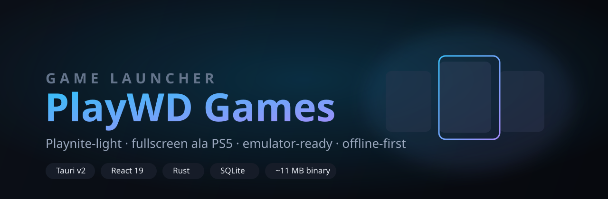

<div align="center">



# PlayWD Games

**A lightweight, Playnite‑inspired game launcher with a PS5‑style fullscreen mode — built for shipping curated game libraries on portable HDDs.**

[](https://tauri.app)
[](https://react.dev)
[](https://www.rust-lang.org)
[](https://www.typescriptlang.org)
[](https://www.sqlite.org)
[](#)
[](LICENSE)

</div>

---

## Why this exists

Playnite is great, but it's heavy (hundreds of MB, .NET, plugin sprawl) and awkward to
pre‑configure on the many external drives you hand to customers. **PlayWD Games** is the
opposite: a **single ~11 MB executable**, no runtime to install, an **SQLite database that
travels with the drive**, and a hard split between an **operator** who sets things up and a
**customer** who just browses and plays.

Scan a folder of games, auto‑match artwork and titles, wire up emulators, flip one flag, and
the drive is ready to ship — **fully offline**.

---

## Highlights

| | |
|---|---|
| 🪶 **Tiny & fast** | Tauri v2 (Rust + WebView2). ~11 MB binary, cold‑start in well under a second, no .NET / Node / Electron. |
| 🎮 **Two front‑ends, one app** | A Steam/GOG‑style **Desktop Mode** (cover grid, genre sidebar, right‑click menus) and a **PS5‑style Fullscreen Mode** (spring carousel, dynamic blurred key‑art, full **keyboard + gamepad** navigation). |
| 🔍 **Smart scanner** | Recursively finds real game `.exe`s, groups one game per folder, and filters out `setup.exe`, `vcredist`, uninstallers, crash handlers, redistributables. |
| 🖼️ **Automatic metadata** | Titles, descriptions, genres, release year, developer from **IGDB**; high‑resolution covers *and* landscape backgrounds from **SteamGridDB**. Works keyless too (manual entry / paste‑URL / local file). |
| 🕹️ **Emulator‑ready** | First‑class **PCSX2** and **RPCS3** profiles with a tested pure‑function command builder, plus arbitrary **manual play actions** (exe + args + working dir) — Playnite‑style. |
| 💾 **Genuinely portable** | Everything lives in `data/` next to the exe. Game paths are stored relative to their library root; move the drive, mount it on any letter, and a one‑click **relink** banner fixes the rest. |
| 🔒 **Operator / customer split** | One `operator_mode` flag hides all setup UI. `make-portable.ps1` bakes a customer build that **strips your API keys** but keeps the fully populated library. |

---

## Screenshots

> Fullscreen Mode — dynamic key‑art background, spring carousel, gamepad prompts.

<div align="center">

*(drop your own captures into `docs/` and link them here)*

</div>

---

## Quick start

> **Prerequisites:** [Rust](https://rustup.rs) (stable), Node ≥ 20, and the MSVC C++ build
> tools / Windows SDK (any recent Visual Studio or Build Tools install). WebView2 ships with
> Windows 10/11.

```bash
git clone https://github.com/adifreza/playwdgames
cd playwdgames
npm install

npm run tauri dev              # run with hot reload
npm run tauri build           # produce the .exe + MSI + NSIS installer
cd src-tauri && cargo test    # backend unit tests
```

> On Windows, `cargo` is often not on `PATH` after a `rustup` install — prefix your shell
> with `$env:Path = "$env:USERPROFILE\.cargo\bin;$env:Path"` (PowerShell) or
> `export PATH="$HOME/.cargo/bin:$PATH"` (bash).

### Setting up a library (operator)

1. **Settings → Library Folders** → add a folder on the drive.
2. **+ Add Game** → *Scan* → tick the real games, fix titles → *Import*.
3. Add your **IGDB** and/or **SteamGridDB** keys under *Settings → Metadata* to auto‑fill
   everything — see [`docs/api-setup.md`](docs/api-setup.md). (Customers never need keys.)
4. Assign emulators or custom launch actions per game via **right‑click → Play settings**.
5. `powershell -File scripts/make-portable.ps1` → ship `dist-portable/`.

---

## Architecture

```
src/                    React 19 · TypeScript (strict) · Tailwind v4 · Zustand · motion
  lib/ipc.ts            the single typed boundary to the backend
  modes/desktop         Steam/GOG-style grid + detail drawer + context menus
  modes/fullscreen      PS5-style carousel + Web Gamepad API
  views/                BulkImport · GameDetail (tabbed editor) · Settings

src-tauri/src/          Rust
  scanner.rs            walk + detect + filter, two-step bulk import
  metadata.rs           IGDB OAuth + SteamGridDB, artwork download (async)
  emulator.rs           profiles + build_launch_command (pure, unit-tested)
  games.rs              list / launch / artwork, asset-protocol image serving
  paths.rs              drive-letter-independent path storage (unit-tested)
  db.rs                 rusqlite + hand-rolled migration runner (PRAGMA user_version)
```

- **Images** are served over Tauri's **asset protocol** (`convertFileSrc`), not base64 —
  landscape key‑art can be several MB.
- **Migrations** are ordered `.sql` files `include_str!`'d into the binary; the runner
  applies anything newer than `user_version`.
- **No `.unwrap()`** on user‑reachable paths; every command returns `Result<T, Error>` that
  serialises to a readable string for the UI.

A full guide for contributors lives in [`ARCHITECTURE.md`](ARCHITECTURE.md).

---

## Status

Feature‑complete against its original roadmap (scanner → metadata → fullscreen → emulators →
packaging). Backend test suite green; frontend type‑checks under `strict` and passes
`oxlint`. Pre‑1.0: the app icon is still the Tauri default, only one play action per game is
supported today, and it targets Windows first.

## Roadmap ideas

- Multiple play actions per game (launcher + config tool + mod manager)
- Downscale oversized key‑art on download
- Cross‑platform file‑manager integration
- Optional IGDB‑only text metadata refresh

---

## License

[MIT](LICENSE) © MOHAMMAD NADIF REZA FAHELVI
